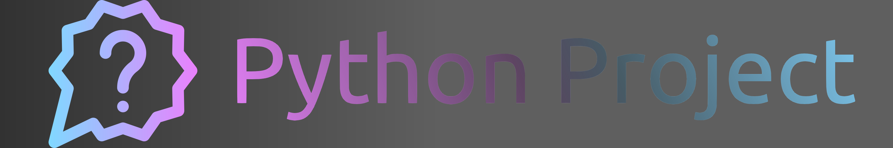
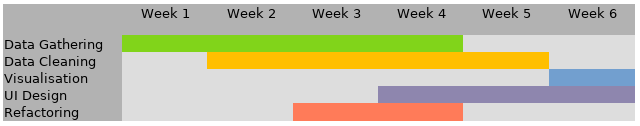

# Python Sample Project

## Description

For your project, you should mention here

- what your project is
- why you chose this project and goal, and
- how you plan to achieve it.

In the section on how you aim to achive your goal(s), you may want to include sub-sections for each of the main features your project is comprised of.
However, keep this part rather short, and preferably move details into the __functionalities__ section.

## Functionalities

Add your plans (with external libraries if you plan on using any) for any of these subsections, if applicable to your project.
As mentioned in the **outline document**, at least 60% of these have to be implemented.

### Data Sources and Retrieval

Will your data be sourced
- From an open dataset (eg. kaggle, data paper,...)
- Collected from an API or a Webcrawler
- From your own research

Reference your data source(s) as well as any tools you will use to collect it, such as API libraries, conversion tools etc.

### Data Storage and Handling

Will you be using a database system (eg. SQL, MongoDB,...)?
How will you load and process data, and what libraries do you plan to use for this (eg. pandas/polars, numpy,...)?

### User Management

Will your project have distinct users?
If so, how do you store and check credentials?
Are there different roles (eg. customer/admin) with privileges?

### Interface

What kind of interface are you planning (CLI/GUI)?
What libraries do you need for this?

### Statistical Analysis

### Visualizations

## Installation and Usage

This should inform anyone who looks at your project repository on how they can install and run the project code on their own machine, e.g. by cloning this repository, installing dependencies and running some main script.

## Timeline

Give some outline as to what should be achieved at what time during project development.
You could also create a visual guide, such as this

to make sure all relevant aspects of developing an application are accounted for with sufficient time, and in sensible order.
This can also help you and the tutors to make sure the development does not go off the rails, and thus ensure a finished project at the deadline.

## Team Members

Just provide a list of all team members with their names (and optionally contact info or similar).

## Acknowlegdments

Here, you can (and should) mention all libraries you used, data sources, as well as other credits such as inspirations for your projects, papers that helped with your methodology or similar things.

If you want, you can create subsections for all of these, or just create bullet-points for it. If possible, provide a link to the original source.
